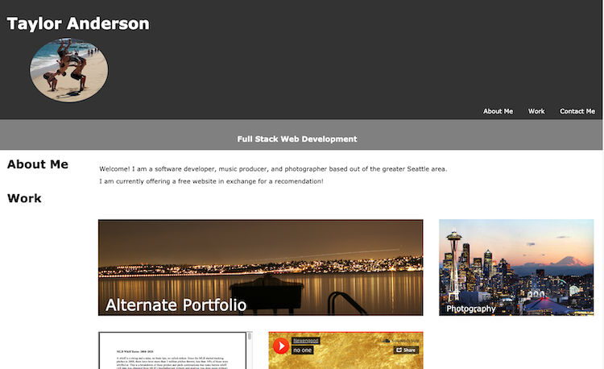

# Advanced CSS: Portfolio




## Link to deployed application

https://newengood.github.io/homework-02-submission/

## Description: 

Create a professional portfolio.

## Acceptance Criteria

Here are the critical requirements necessary to develop a portfolio that satisfies a typical hiring manager’s needs:

```
GIVEN I need to sample a potential employee's previous work
WHEN I load their portfolio
THEN I am presented with the developer's name, a recent photo or avatar, and links to sections about them, their work, and how to contact them - [X]
WHEN I click one of the links in the navigation
THEN the UI scrolls to the corresponding section - [X]
WHEN I click on the link to the section about their work
THEN the UI scrolls to a section with titled images of the developer's applications - [X]
WHEN I am presented with the developer's first application
THEN that application's image should be larger in size than the others - [X]
WHEN I click on the images of the applications
THEN I am taken to that deployed application -[X]
WHEN I resize the page or view the site on various screens and devices
THEN I am presented with a responsive layout that adapts to my viewport -[X]
```

### Technical Acceptance Criteria: 40%

* Satisfies all of the above acceptance criteria. -[X]

### Deployment: 32%

* Application deployed at live URL. - [X]

* Application loads with no errors. - [X]

* Application GitHub URL submitted. -[X]

* GitHub repository contains application code. - [X]

### Application Quality: 15%

* Application resembles the mock-up functionality provided in the homework instructions. - [X]

### Repository Quality: 13%

* Repository has a unique name. - [X]

* Repository follows best practices for file structure and naming conventions. - [X]

* Repository follows best practices for class/id naming conventions, indentation, quality comments, etc. - [X]

* Repository contains multiple descriptive commit messages. - [X]

* Repository contains quality readme with description, screenshot, link to deployed application. - [X]

- - -
